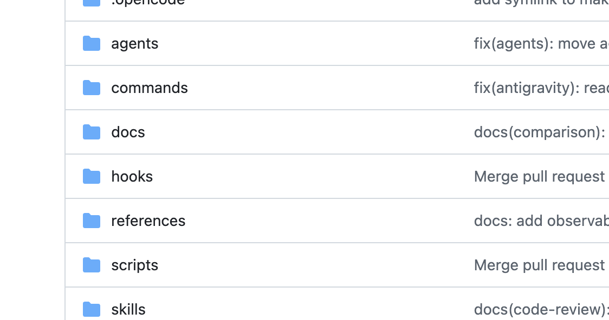

이 글은 Notion → Hugo 동기화 파이프라인을 테스트하기 위한 예시입니다.

## 무엇을 확인하나요

- 본문 마크다운 변환
- 이미지 1시간 만료 → 로컬 저장 치환
- 코드 블록 하이라이트

## 코드 하이라이트 테스트

```go
package main

import "fmt"

func main() {
	fmt.Println("Hello, Hugo from Notion!")
}
```

> 이 글의 Status를 Draft로 바꾸면 빌드에서 제외되어야 합니다.


